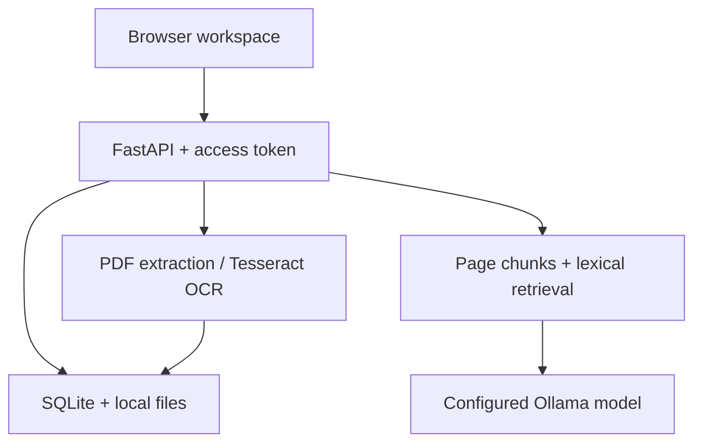

# இணை · Tamil–English Document Intelligence

A local-first document workspace for Tamil and English PDFs and scanned images. Upload a document, extract page text, search for evidence, create an extractive summary, and use a configured Ollama model for translation and document questions.

**Status:** runnable single-owner application. Source code is published here; a hosted public service is not included. OCR and retrieval operate locally. Generative tasks require a separately installed and downloaded Ollama model. The interface reports unavailable services instead of returning sample answers.

## Features

- PDF, PNG, JPEG, TIFF and WebP upload, with a 16 MB / 32-page limit.
- Digital PDF text extraction and Tesseract OCR for scanned pages.
- Tamil (`tam`), English (`eng`) or mixed Tamil–English (`tam+eng`) OCR; optional OCR of every PDF page.
- Background extraction queue with queued, processing, ready and failed states.
- Persistent SQLite document metadata, page text, extraction method and OCR engine confidence.
- Page-by-page reading and evidence links back to extracted source pages.
- Unicode-aware Tamil and English lexical retrieval with BM25-style ranking.
- Extractive key sentences with page references; no model required.
- Ollama-backed document Q&A, excerpt summaries and page translation into Tamil or English.
- Text and JSON export; reversible archive and restore; retry after extraction errors.
- Workspace access token, same-origin request checks and browser security headers.
- Docker packaging, optional Ollama service, automated API/OCR tests and clear setup instructions.

## Architecture



Uploaded documents stay on the application server. OCR and search do not call external APIs. AI requests send selected text to `OLLAMA_URL`, which defaults to localhost; changing this URL changes where document content is sent. There are no external scripts, analytics or font downloads in the browser interface.

## Quick start with Docker

Requirements: Docker Engine and Docker Compose. The image includes Tesseract Tamil and English language data.

```bash
git clone https://github.com/sooryaprakashrnp-wq/tamil-english-document-intelligence.git
cd tamil-english-document-intelligence
docker compose up --build -d
docker compose logs app
```

Open **http://localhost:8000**. Copy the private workspace access token from the application startup log into the unlock form. Do not publish the token or commit application logs. The app binds the host port to loopback in Compose. OCR, search, extraction and exports work without an AI model.

### Enable translation and generative answers

1. Install/download a multilingual model supported by your Ollama installation and hardware. For example, if available in your Ollama registry:

   ```bash
   docker compose exec ollama ollama pull qwen3:4b
   ```

2. Copy `.env.example` to `.env`, set `OLLAMA_MODEL=qwen3:4b` (or your exact downloaded model name), and recreate the application container:

   ```bash
   docker compose up -d --force-recreate app
   ```

3. Open a ready document, choose an AI action and output language, then run the task.

Model quality and memory requirements vary. Test Tamil output on your own documents. The model name is configuration, not an assurance of accuracy. Downloads can be several GB. CPU execution may take longer than the 120-second request timeout; choose a smaller suitable model or use an appropriately configured GPU runtime. The default Compose file uses CPU execution.

## Local Python setup

Use Python 3.12. On Debian/Ubuntu install OCR and language data:

```bash
sudo apt-get update
sudo apt-get install tesseract-ocr tesseract-ocr-tam tesseract-ocr-eng
python -m venv .venv
source .venv/bin/activate
pip install -r requirements.txt
cp .env.example .env
python run.py
```

On Windows, activate with `.venv\Scripts\Activate.ps1`, copy the environment template with `Copy-Item .env.example .env`, and install Tesseract with `tam` and `eng` language data on PATH. Docker is the more consistent setup across platforms.

Verify OCR installation using `tesseract --list-langs`. Both `tam` and `eng` should appear for mixed-language OCR. Digital PDFs can be extracted without OCR language packs when they contain sufficient embedded text.

For a locally installed Ollama server, use `OLLAMA_URL=http://127.0.0.1:11434`. Download a model using Ollama, set `OLLAMA_MODEL` to the exact model name, and restart the Python application.

## Configuration

`run.py` reads `.env` before importing the app. Existing process environment variables take precedence. Direct `uvicorn app:app` usage requires exporting configuration yourself.

| Variable | Default | Meaning |
|---|---|---|
| `HOST` | `127.0.0.1` | Listening interface for the Python launcher |
| `PORT` | `8000` | HTTP port |
| `APP_ORIGIN` | `http://localhost:8000` | Exact browser origin for mutation requests |
| `DATA_DIR` | `storage` beside app | Writable persistent storage |
| `APP_TOKEN` | Generated if absent | At least 24 random characters; private workspace access |
| `OLLAMA_URL` | `http://127.0.0.1:11434` | Server-side Ollama endpoint |
| `OLLAMA_MODEL` | Empty | Exact model name; empty disables generative tools |

Compose sets the internal Ollama URL to `http://ollama:11434`. Its document and model volumes survive ordinary container recreation. Do not use `docker compose down -v` unless you intend to remove the stored data. The generated token is stored in `storage/access-token` with restrictive permissions; in Docker it lives in the documents volume. The browser retains it only in tab session storage until Lock is selected or the session ends.

## Using the workspace

1. Unlock with your private workspace token.
2. Select a PDF or supported image and choose the document language.
3. Upload and wait for extraction. OCR can take up to a minute per page.
4. Select the document, choose a page and review its extracted text.
5. Search using words in the document language. Search results link to the matching extracted page.
6. Use **Extract key sentences** for an offline extractive summary.
7. Use AI tools for translation, questions or a generated summary of selected excerpts.
8. Export text/JSON or archive documents. Switch on **Show archived documents** to restore them.

OCR confidence is a Tesseract engine estimate, **not measured accuracy**. Embedded PDF text has no OCR confidence value. Poor scans, handwriting, columns, tables and unusual fonts can produce incorrect reading order or text. Review the original document when precision matters. The application currently shows extracted text rather than an original-page image viewer.

## Retrieval and grounding

Text is normalized to Unicode NFC. Tamil combining marks remain with Tamil word tokens. Page text is split into 1,000-character windows with an 800-character stride; chunks retain page numbers. Query terms rank these chunks using a BM25-style lexical score.

This is not semantic embedding retrieval or automatic cross-language search. An English question may not retrieve a Tamil-only passage unless it shares words/numbers. Use source-language keywords or translate the relevant page first. No-match queries return an explicit no-evidence result.

The extractive summary selects source sentences by corpus term frequency and returns them in document order. The generative summary receives selected excerpts, not necessarily the whole document. Translation processes the selected page, with a 12,000-character page limit.

The model receives document text as untrusted data, has no tools, and is instructed to answer from evidence only. Output JSON and page references are validated against supplied pages. Valid page numbers do not guarantee factual support: generated answers still need human review. Prompt injection cannot be fully eliminated by instructions alone.

## Storage and processing

SQLite stores document ID, display name, SHA-256, selected language, OCR mode, status, error, extracted pages, creation time and archive state. Uploaded bytes are stored under generated IDs, so client filenames do not become filesystem paths.

One worker processes extraction jobs. At most eight jobs are admitted at once. One AI request runs at a time. Interrupted queued/processing records become failed on startup and can be retried from the interface. Completed records persist across restarts. Archive hides a document without deleting its bytes or text.

Run **one application process** against a data directory. Do not enable multiple Uvicorn workers or multiple replicas; scheduling, limits and lifecycle ownership are process-local. Keep backups of the entire data directory with the app stopped. Backups contain original documents, extracted content and the private token. Encrypt and restrict them. Account management, per-user isolation and automatic retention/deletion policies are not included in this single-owner version.

## API reference

All document endpoints require `Authorization: Bearer <workspace-token>`. Do not put the token in query parameters. The interface attaches it automatically.

| Method and route | Purpose |
|---|---|
| `GET /api/health` | Public liveness check; no document data |
| `GET /api/status` | OCR languages and configured model |
| `GET /api/documents?archived=false` | Document list |
| `POST /api/documents` | Multipart `file`, `language`, `force`; returns queued ID |
| `GET /api/documents/{id}` | Metadata and extracted pages |
| `PATCH /api/documents/{id}` | `{"archived": true}` or false |
| `POST /api/documents/{id}/retry` | Retry a failed extraction |
| `GET /api/documents/{id}/export?format=txt` | TXT or JSON export |
| `POST /api/documents/{id}/search` | `{"query": "உதவித்தொகை"}` |
| `GET /api/documents/{id}/summary` | Offline extractive summary |
| `POST /api/documents/{id}/ai` | `action`, `language`, optional `question` and `page` |

AI action values: `question`, `summary`, `translate`. Output language: `Tamil` or `English`. Translation requires an existing page number. Status codes distinguish invalid input (400/415/422), unauthorized access (401), wrong origin (403), missing records (404), non-ready documents (409), queue saturation (429), and unavailable AI (503).

## Repository files

| File | Responsibility |
|---|---|
| `app.py` | HTTP routes, authorization, persistence, queue and job lifecycle |
| `engine.py` | PDF/image extraction, Tesseract OCR, Unicode tokens, retrieval and extractive summary |
| `model.py` | Ollama requests, structured output and citation validation |
| `run.py` | Environment loading and local server startup |
| `index.html`, `style.css`, `app.js` | Responsive reading workspace and interactions |
| `test_platform.py` | API lifecycle, extraction, Tamil retrieval and model contract tests |
| `requirements*.txt` | Runtime and test dependencies |
| `Dockerfile`, `compose.yaml` | Application/OCR container and local Ollama service |
| `.env.example` | Configuration template; no secrets |

## Tests

```bash
pip install -r requirements-dev.txt
python -m pytest -q
node --check app.js
```

The real image OCR test requires Tesseract English and the DejaVu Sans font (`fonts-dejavu-core` on Debian/Ubuntu). Tests create isolated temporary storage and use a synthetic access token. Tests cover authentication, cross-origin rejection, file validation, digital PDF extraction, actual English and Tamil image OCR, Tamil Unicode search, empty-result behavior, exports, archiving/restoring, persistent records, broken files, unavailable models, and mocked Ollama citation contracts.

`sample-tamil.png` is a synthetic Tamil scan fixture, suitable for a first upload. The Tamil OCR integration test runs when the `tam` language data is installed; otherwise pytest reports it as skipped.

Mocked model tests do not establish live translation quality. No live model inference benchmark, Tamil OCR accuracy percentage, production load claim or independent security audit is claimed. A suitable downloaded model and user-reviewed bilingual evaluation set are needed before measuring real-world translation/Q&A quality.

## Troubleshooting

| Problem | Resolution |
|---|---|
| Workspace rejects the token | Use the token from this instance; click Lock to clear a stale tab token |
| `Missing Tesseract language data: tam` | Install `tesseract-ocr-tam`, then retry the document |
| Extraction fails | Confirm supported bytes/format, unlocked PDF, page limit and readable scan |
| Document remains failed after a restart | Click Retry extraction |
| Search finds nothing | Try exact document-language keywords; cross-language semantic retrieval is not implemented |
| AI reports not configured | Download a model, set `OLLAMA_MODEL`, restart app |
| Ollama request fails | Confirm endpoint, exact model tag, available memory and timeout |
| Changes return 403 | Match `APP_ORIGIN` to the browser URL, including port |
| Queue is full | Allow existing OCR/AI work to finish |
| Data disappears | Use a persistent volume for the entire data directory |

## Deployment boundaries

This is a private, single-owner workstation application. Default configurations bind to localhost. For remote use, add HTTPS, an authenticated gateway, request/body/time limits and monitoring; never expose the Ollama port publicly. The shared workspace token is not a multi-user identity system. Upload parsing is resource-intensive: isolate the service/container and restrict who can upload. Antivirus scanning and sandboxed PDF parsing are future hardening work.

## Roadmap (not implemented)

- Original-page image viewer and OCR correction editor.
- Multilingual embeddings and evaluated cross-language retrieval.
- Table/layout extraction and handwriting-specialized OCR.
- Multi-user accounts, document ownership and audit logs.
- Durable distributed job queue and separate OCR workers.
- OCR CER/WER and citation-grounding evaluation on a consented bilingual dataset.

## References and dependency licenses

- [Tesseract language data](https://tesseract-ocr.github.io/tessdoc/Data-Files-in-different-versions.html)
- [Tesseract installation](https://tesseract-ocr.github.io/tessdoc/Installation.html)
- [Ollama structured outputs](https://ollama.com/blog/structured-outputs)
- [PyMuPDF](https://pymupdf.readthedocs.io/)

PyMuPDF is available under AGPL/commercial licensing; review its terms before redistribution or commercial deployment. Other dependencies and downloaded models retain their own licenses. No independent project license is granted by this repository's public visibility.
